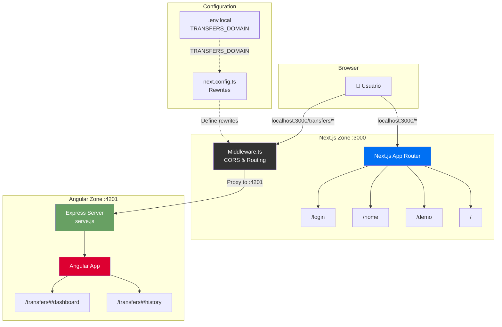

# 🏦 Bytebank: Front-End

Este repositório contém a aplicação **front-end do Bytebank**, um projeto de aplicativo bancário digital desenvolvido na pós-graduação em Front-End Engineering da FIAP. O projeto foi construído para demonstrar boas práticas de desenvolvimento, responsividade, e a aplicação de um design system intuitivo e charmoso.

## 📋 Arquitetura Multi-Zones

Este projeto implementa uma **arquitetura de micro-frontends** usando Next.js Multi-Zones, permitindo integração entre Next.js e Angular em uma única aplicação. Esta abordagem foi desenvolvida com base em pesquisas e discussões da comunidade ([referência](https://discord.com/channels/1255291574045376644/1395759720328859698)).

### Divisão por Zonas

- **🟦 Zona Principal (Next.js)**: Dashboard, autenticação, configurações
- **🟥 Zona Angular**: Módulo de transferências com dashboard e histórico

---

## 💻 Layouts

Confira como a aplicação se adapta a diferentes tamanhos de tela.

### Desktop

<p align="center">
  
</p>

### Tablet

<p align="center">
  
</p>

### Mobile

<p align="center">
  
</p>

---

## 🛠️ Tecnologias e Arquitetura

### Stack Principal

| Categoria       | Tecnologias                                                                                                                                                                                                                                                                                                                                                                                  |
| :-------------- | :------------------------------------------------------------------------------------------------------------------------------------------------------------------------------------------------------------------------------------------------------------------------------------------------------------------------------------------------------------------------------------------- |
| **Frameworks**  | [](https://nextjs.org/) [](https://react.dev/) [](https://angular.io/) |
| **Arquitetura** | Multi-Zones, Micro-frontends                                                                                                                                                                                                                                                                                                                                                                 |

### Estrutura de Zonas

```
bytebank-ui/
├── src/                          # 🟦 Zona Principal (Next.js)
│   ├── app/                      # App Router
│   ├── components/               # Componentes React
│   └── middleware.ts            # Roteamento entre zonas
├── microfrontends/
│   └── transfers-mf/           # 🟥 Zona Angular
│       ├── src/app/
│       ├── angular.json
│       └── serve.js           # Servidor Express
└── next.config.ts             # Configuração de rewrites
```

### Diagrama da Arquitetura



---

## 🌐 Roteamento Multi-Zones

### URLs Principais

- **`/`** → Zona Next.js (redireciona baseado na autenticação)
- **`/demo`** → Zona Next.js (página de demonstração Multi-Zones)
- **`/login`** → Zona Next.js (autenticação)
- **`/home`** → Zona Next.js (dashboard do usuário autenticado)
- **`/transfers/*`** → Zona Angular (transferências)
- **`/transfers-static/*`** → Assets estáticos do Angular

### Rotas Angular Internas

- **`/transfers#/dashboard`** - Dashboard principal de transferências

---

## ⚙️ Como Rodar Localmente

### Pré-requisitos

- [Node.js](https://nodejs.org/) (versão 18 ou superior)
- [npm](https://www.npmjs.com/)

### Configuração Completa

1.  **Clone o repositório e acesse a pasta do front-end:**

    ```sh
    git clone https://github.com/gabriel-piva/bytebank.git
    cd bytebank-ui
    ```

2.  **Configure variáveis de ambiente:**

    Crie um arquivo `.env.local` na raiz:

    ```env
    NEXT_PUBLIC_API_URL=http://localhost:3003
    TRANSFERS_DOMAIN=http://localhost:4201
    ```

3.  **Instale dependências principais:**

    ```sh
    npm install
    ```

4.  **Instale dependências do Angular:**

    ```sh
    cd microfrontends/transfers-mf
    npm install
    ```

### Execução

#### Desenvolvimento Next (na raiz da pasta bytebank-ui)

```sh
# em um terminal, na raiz da pasta bytebank-ui
npm run dev
```

#### Desenvolvimento Angular ()

```sh
# em outro terminal, na pasta bytebank-ui/microfrontends/transfers-mf
npm run dev
```

- **Next.js**: http://localhost:3000
- **Angular**: http://localhost:4201
- **Angular via Proxy**: http://localhost:3000/transfers

### URLs de Acesso

- **🏠 Página Principal**: http://localhost:3000/institucional
- **🔐 Login**: http://localhost:3000/login
- **📊 Dashboard**: http://localhost:3000/home
- **💸 Transferências**: http://localhost:3000/transfers (MF Angular)

---

## 🏗️ Configuração Técnica Multi-Zones

### Next.js Configuration (`next.config.ts`)

```typescript
async rewrites() {
  return {
    beforeFiles: [
      {
        source: '/transfers/:path*',
        destination: `${process.env.TRANSFERS_DOMAIN}/transfers/:path*`,
      },
      {
        source: '/transfers-static/:path*',
        destination: `${process.env.TRANSFERS_DOMAIN}/transfers-static/:path*`,
      },
    ],
  };
}
```

### Angular Configuration (`angular.json`)

```json
{
  "build": {
    "options": {
      "baseHref": "/transfers/",
      "deployUrl": "/transfers-static/"
    }
  }
}
```

### Middleware CORS (`middleware.ts`)

```typescript
// Configuração de CORS para comunicação entre zonas
if (pathname.startsWith("/transfers")) {
  response.headers.set("Access-Control-Allow-Origin", transfersDomain);
}
```

---

## 📊 Benefícios da Arquitetura

### 🚀 **Escalabilidade**

- Equipes independentes por zona
- Build times otimizados
- Deploy granular

### ⚡ **Performance**

- Lazy loading entre zonas
- Bundle splitting automático
- Cache otimizado por tecnologia

### 🔧 **Flexibilidade**

- Tecnologias diferentes por zona
- Versionamento independente
- Rollback granular

### 👥 **Desenvolvimento**

- Times podem trabalhar separadamente
- Redução de conflitos de merge
- Ciclo de desenvolvimento mais rápido

---

## 🔍 Debug e Troubleshooting

### Logs de Desenvolvimento

O middleware inclui logs úteis para debug:

```
🔄 Middleware: /transfers/dashboard
🚀 Microfrontend Angular rodando em http://localhost:4201
```

---

## 📚 Referências

Esta implementação foi desenvolvida com base em:

- [Discussão da comunidade sobre Multi-Zones](https://discord.com/channels/1255291574045376644/1395759720328859698)
- [Next.js Multi-Zones Documentation](https://nextjs.org/docs/advanced-features/multi-zones)
- [Angular Micro-frontends Best Practices](https://angular.io/guide/elements)

---
